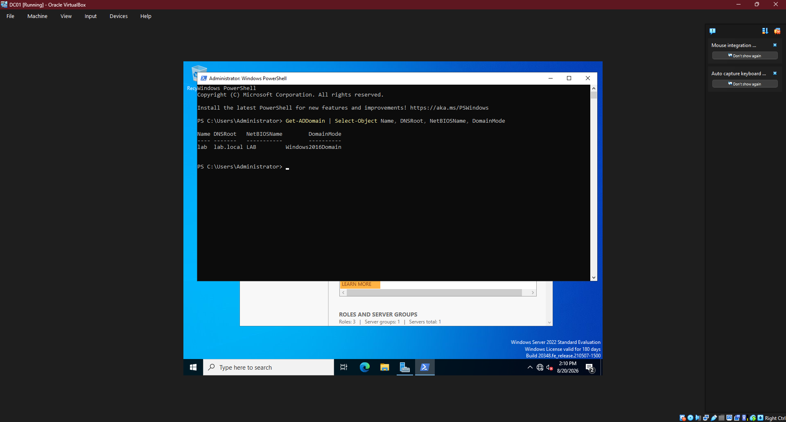
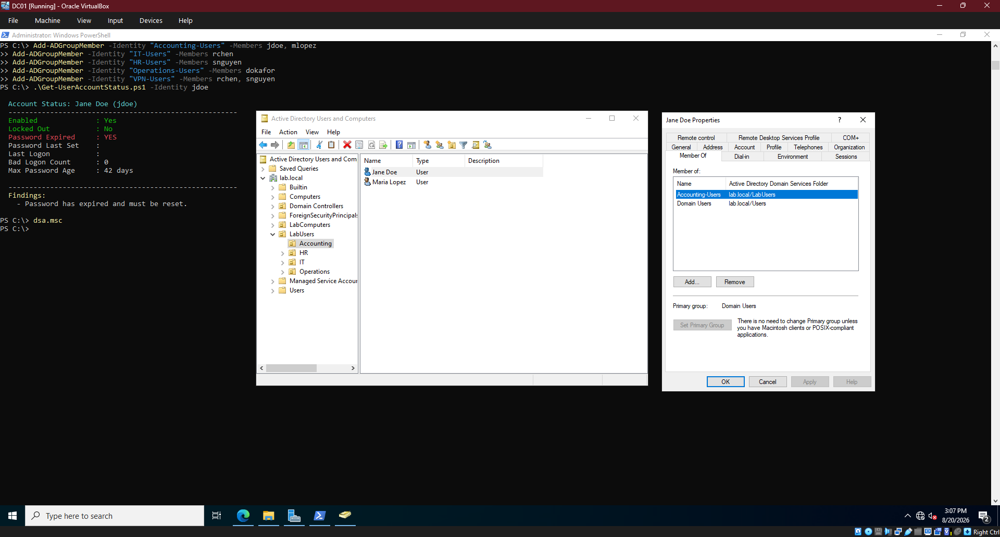
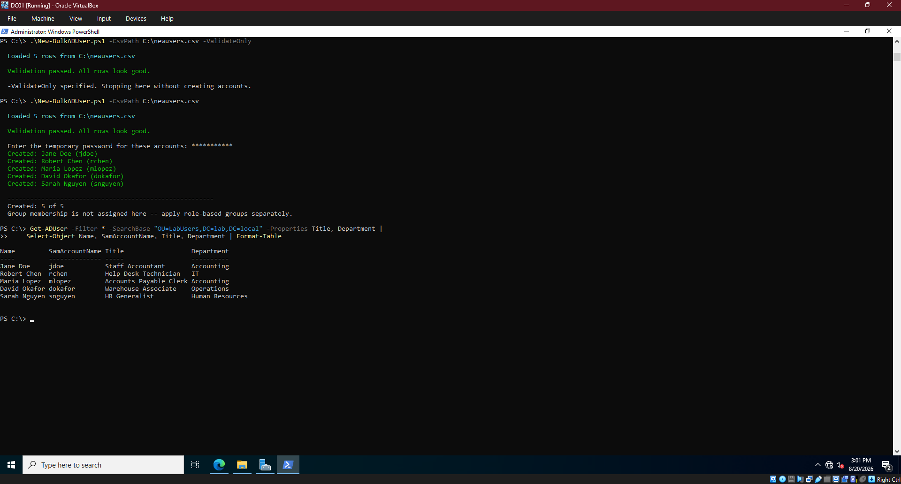
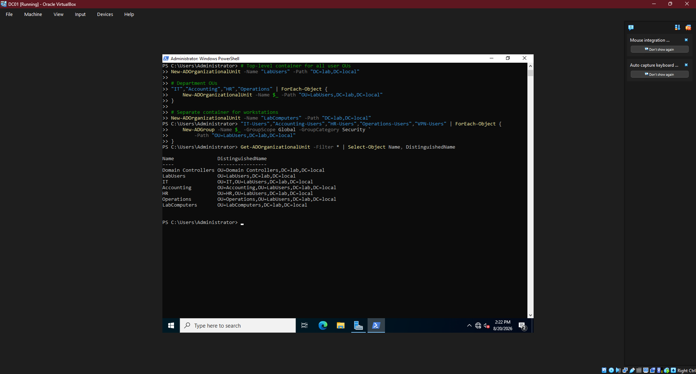

# Active Directory Home Lab

A Windows domain built from scratch in VirtualBox: a domain controller running
AD DS, DNS, and DHCP, with a Windows 11 client joined to the domain and
authenticating against it.

The point of this lab was to work with the tools a help desk technician
actually touches -- Active Directory Users and Computers, DHCP scopes, domain
joins, account provisioning -- rather than read about them.

---

## Environment

| Machine | Role | OS | Resources | Address |
|---|---|---|---|---|
| **DC01** | Domain Controller | Windows Server 2022 (Desktop Experience) | 4 GB RAM, 2 vCPU, 60 GB | 10.0.10.10 (static) |
| **CLIENT01** | Member Workstation | Windows 11 Enterprise | 4 GB RAM, 2 vCPU, 60 GB | 10.0.10.100 (DHCP) |

**Network:** VirtualBox NAT Network `LabNet`, 10.0.10.0/24, with VirtualBox's
own DHCP disabled so DC01 serves addresses instead.

**Domain:** `lab.local` (NetBIOS: `LAB`)

---

## Build Summary

### 1. Domain Controller

Installed AD DS and promoted the server to the first domain controller in a new
forest:

```powershell
Install-WindowsFeature -Name AD-Domain-Services -IncludeManagementTools

Install-ADDSForest -DomainName "lab.local" -DomainNetbiosName "LAB" `
    -InstallDns:$true -Force
```

A domain controller needs a static address, since every client depends on it
for DNS. Its own DNS setting points at `127.0.0.1` -- the machine is the DNS
server it is asking.

### 2. DHCP

```powershell
Install-WindowsFeature -Name DHCP -IncludeManagementTools
Add-DhcpServerInDC -DnsName "DC01.lab.local" -IPAddress 10.0.10.10

Add-DhcpServerv4Scope -Name "LabNet" `
    -StartRange 10.0.10.100 -EndRange 10.0.10.200 `
    -SubnetMask 255.255.255.0 -State Active

Set-DhcpServerv4OptionValue -ScopeId 10.0.10.0 `
    -Router 10.0.10.1 -DnsServer 10.0.10.10 -DnsDomain "lab.local"
```

`Add-DhcpServerInDC` is the authorization step. Active Directory requires DHCP
servers to be explicitly approved, because an unauthorized DHCP server can
redirect an entire network by handing out its own gateway and DNS.

The scope starts at `.100` deliberately, leaving `.1` through `.99` for servers,
printers, and anything else needing a fixed address.

### 3. Organizational Structure

```powershell
New-ADOrganizationalUnit -Name "LabUsers" -Path "DC=lab,DC=local"

"IT","Accounting","HR","Operations" | ForEach-Object {
    New-ADOrganizationalUnit -Name $_ -Path "OU=LabUsers,DC=lab,DC=local"
}

New-ADOrganizationalUnit -Name "LabComputers" -Path "DC=lab,DC=local"
```

Plus role-based security groups per department. Access gets assigned through
group membership rather than direct permissions -- group membership is visible,
auditable, and simple to revoke when someone leaves.

### 4. User Provisioning

Users were created with
[`New-BulkADUser.ps1`](../04-powershell-scripts/New-BulkADUser.ps1) from this
portfolio, reading from a CSV. The script validates every row against the
directory before creating anything, so a bad row cannot leave the batch half
applied.

### 5. Client Domain Join

```powershell
Add-Computer -DomainName "lab.local" `
    -OUPath "OU=LabComputers,DC=lab,DC=local" `
    -Credential (Get-Credential) -Restart
```

`-OUPath` places the computer object in the intended OU rather than the default
Computers container, which matters because Group Policy cannot be linked to
that default container.

---

## Verification

### DHCP delivering addresses and options



The client received `10.0.10.100` from DC01, along with the DNS server and
domain suffix configured in the scope options. This confirms the whole DHCP
path end to end rather than just that the service is running.

### Directory structure and group membership



The OU tree with users in place, and a user's Member Of tab confirming the
group assignment applied.

### Account provisioning and diagnostics



Validation pass, creation pass, and a verification query. The account status
script then reports `Password Expired: YES` on a new account -- which is the
intended state, not a fault. Accounts created with change-at-next-logon are
marked expired so the user is forced to set their own password at first login.

### Domain join confirmed from both sides



The server shows `CLIENT01.lab.local` registered in the LabComputers OU; the
client reports itself as a member workstation of `lab.local`. Checking from
both ends distinguishes "the command did not error" from "the object exists
where it was supposed to go."

---

## Notes From the Build

**Windows 11 needs UEFI, TPM 2.0, and Secure Boot** enabled in the VM settings
or setup refuses to install. Server 2022 has no such requirement, which makes
the failure confusing the first time -- the same host builds one VM fine and
rejects the other.

**Windows 11 Home cannot join a domain.** The Enterprise evaluation ISO is the
right choice for a lab, and it also avoids the forced Microsoft account signup
during setup via the "Domain join instead" option under Sign-in options.

**Encoding matters in PowerShell scripts.** Scripts written with typographic
characters such as em dashes fail to parse under Windows PowerShell 5.1, which
reads `.ps1` files as ANSI unless a byte-order mark is present. The scripts in
this portfolio were converted to plain ASCII after this surfaced when running
them against this lab -- a bug that only appears when the code actually runs
somewhere real.

---

## Skills Demonstrated

Windows Server installation and configuration | Active Directory Domain
Services | DNS and DHCP server configuration | Organizational unit and group
design | Domain join and client management | PowerShell administration |
Virtualization and network configuration
