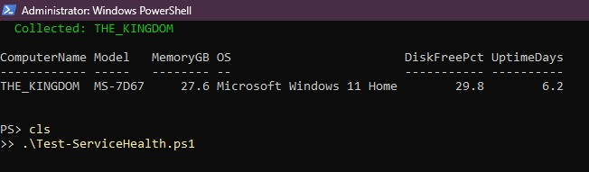
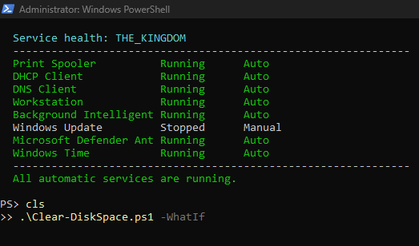
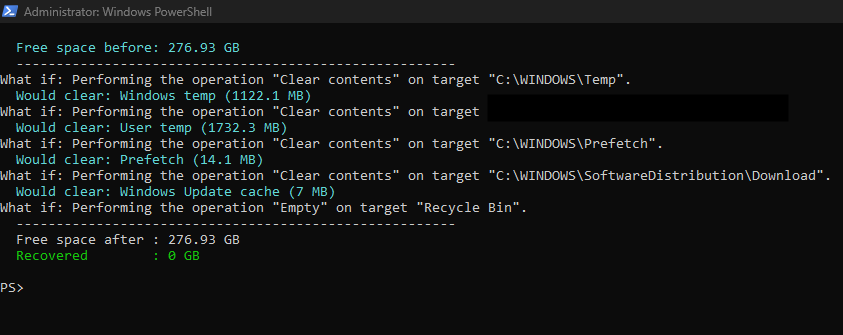

# PowerShell Scripts

Automation for tasks that come up repeatedly in support work. Each script is
commented, takes parameters rather than hardcoded values, and handles the
failure cases you actually hit in practice — a machine that is offline, a user
that does not exist, a share that is unreachable.

## Scripts

| Script | Purpose | Requires |
|---|---|---|
| [Get-SystemInventory.ps1](./Get-SystemInventory.ps1) | Collect hardware and OS details from one or many machines | — |
| [Test-ServiceHealth.ps1](./Test-ServiceHealth.ps1) | Check and optionally restart critical services | — |
| [Clear-DiskSpace.ps1](./Clear-DiskSpace.ps1) | Reclaim space on a workstation low on disk | — |
| [Get-UserAccountStatus.ps1](./Get-UserAccountStatus.ps1) | Diagnose why a user cannot log in | Domain |
| [New-BulkADUser.ps1](./New-BulkADUser.ps1) | Create domain accounts in bulk from a CSV | Domain |

A sample input file, [`sample-newusers.csv`](./sample-newusers.csv), is included
for the bulk user script.

---

## Sample Output

### Get-SystemInventory.ps1

Collects make, model, CPU, memory, disk, OS build, and uptime. Flags machines
under 15% free disk or over 30 days since last reboot — both of which tend to
precede a support call.



### Test-ServiceHealth.ps1

Checks the services whose failure produces misleading symptoms. A stopped Print
Spooler becomes "nobody can print"; a stopped Workstation service becomes "my
mapped drives disappeared."



Note that Windows Update shows as Stopped without being flagged as a problem.
The script only reports services set to start automatically, because a stopped
service set to Manual is behaving normally — flagging it would train the
technician to ignore the output.

### Clear-DiskSpace.ps1

Run here with `-WhatIf`, which reports what would be removed without removing
anything. The summary line confirms nothing was touched.



---

## Conventions Used

**Approved verbs.** PowerShell has a standard verb list (`Get`, `New`, `Set`,
`Test`, `Clear`). Using them keeps scripts predictable for anyone else reading
them, and `Get-Verb` will show the full set.

**Parameters over hardcoding.** Every script takes input as parameters with
sensible defaults, so it can be reused without editing the file.

**`-WhatIf` on anything destructive.** Scripts that delete or change state
support `-WhatIf`. Running a cleanup script against the wrong machine is a bad
afternoon; typing `-WhatIf` first costs nothing.

**Local execution stays local.** Passing `-ComputerName` to `Get-CimInstance`
opens a WinRM session even when the target is the machine you are already on,
which fails wherever remoting is not enabled. These scripts detect the local
case and query directly instead.

**Comment-based help.** Each script includes `.SYNOPSIS` and `.EXAMPLE` blocks,
so `Get-Help .\Script.ps1` works the same way it does for built-in cmdlets.

---

## Running These

Scripts are unsigned, so PowerShell blocks them under the default execution
policy. For a single session:

```powershell
Set-ExecutionPolicy -ExecutionPolicy RemoteSigned -Scope Process -Force
```

This applies only to the current window and reverts when it closes — preferable
to changing the machine-wide policy.

Files downloaded from the internet also carry a Mark of the Web tag, which
blocks them separately from the execution policy. To clear it:

```powershell
Get-ChildItem -Path . -Filter *.ps1 | Unblock-File
```

Worth knowing that this is exactly the wrong thing to run reflexively on a
script that arrived by email — the tag exists for a reason.

The two AD scripts additionally require the ActiveDirectory module, part of
Remote Server Administration Tools, and a reachable domain controller.

Test in a lab before running anything here against production.
